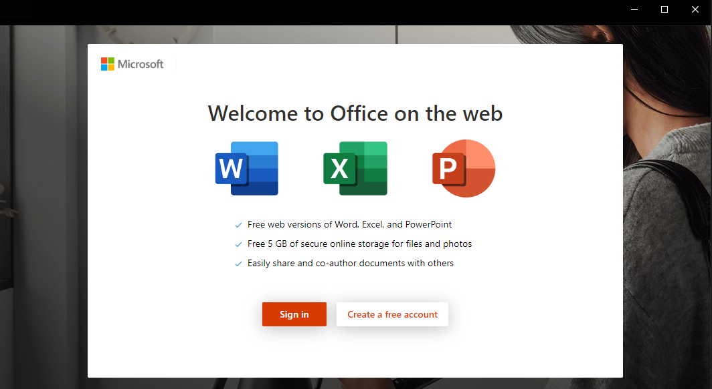
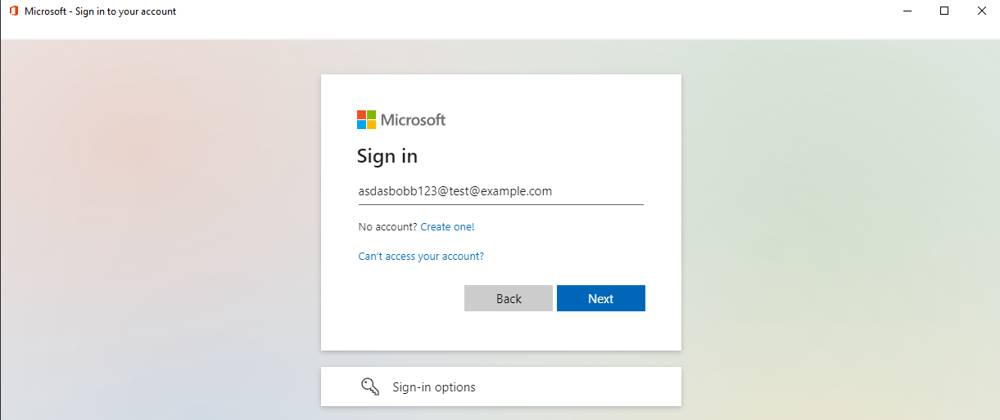
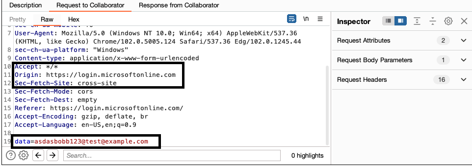
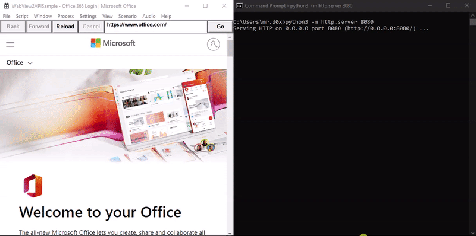
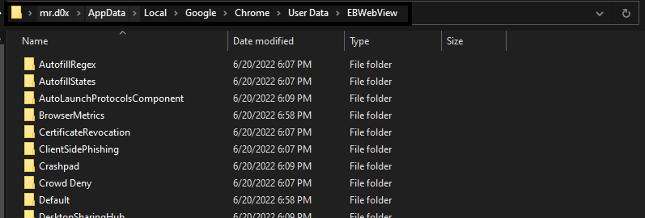
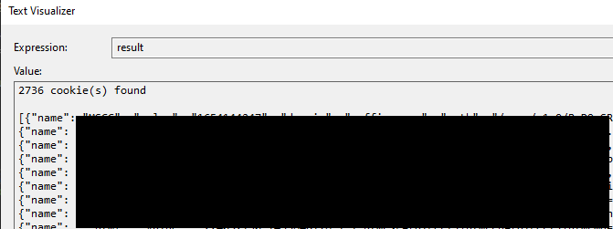

Exploring WebView2 applications and how they can be used for credential and cookie theft<!-- end -->.

# Introduction

According to Microsoft, "Microsoft Edge WebView2 control allows you to embed web technologies (HTML, CSS, and JavaScript) in your native apps". Essentially, WebView2 technology can be used to create an executable that can communicate with web applications similarly to a browser. This is meant to improve desktop applications and provide them with additional capabilities for interaction with web applications. The image below is an example of WebView2 being used in a legitimate Microsoft Office application.



The main advantage of using WebView2 for attackers is the rich functionality it provides when phishing for credentials and sessions. In this post I discuss and show how attackers can create WebView2 applications and use them for several purposes. My code uses a modified version of <a href="https://github.com/MicrosoftEdge/WebView2Samples" target="_blank">Microsoft's WebView2 Samples</a> repository. The research was difficult and time consuming as I had to read a lot of documentation and do a lot of debugging to understand the internal workings of WebView2.

# Injecting JavaScript

Using a built-in WebView2 function, JavaScript can be easily injected into any website. This means you can load up a target website and inject malicious JavaScript (e.g. keylogger).

## JavaScript Keylogger Example

In the example below I use a custom-built WebView2 application that loads ```login.microsoftonline.com``` with an injected JavaScript keylogger.



The image below shows the keylogger successfully fetching the keystrokes.



# Bypass 2FA

WebView2 also provides built-in functionality to extract cookies. This allows an attacker to extract cookies after the user authenticates into the **legitimate website**. This technique removes the need of having to spin up Evilginx2 or Modlishka but the obvious trade-off is that the user must execute the binary and authenticate.

## Exfiltrating Cookies Example

The image below shows how cookies are extracted in base64 format after the user traverses to ```https://mrd0x.com```.



Upon decoding the base64 blob, the cookies are revealed.


# Stealing Chrome Cookies

WebView2 can be used to steal all available cookies for the current user. This was successfully tested on Chrome.

WebView2 allows you to launch with an existing User Data Folder (UDF) rather than creating a new one. The UDF contains all passwords, sessions, bookmarks etc. Chrome's UDF is located at ```C:\Users\<username>\AppData\Local\Google\Chrome\User Data```. We can simply tell WebView2 to start the instance using this profile and upon launch extract all cookies and transfer them to the attacker's server.

## Small Catch

The only catch is that WebView2 looks for a folder called ```EBWebView``` instead of ```User Data``` (not sure why). Make a copy of the ```User Data``` folder and rename it to ```EBWebView```.



## Extracting All Cookies

The image below shows how I was able to load my Chrome UDF and extract all cookies. This functionality is not implemented in the code uploaded to my GitHub repo but it is trivial to implement and the GitHub README explains what needs to be modified in order to get this functionality working.



# Application Demo

I uploaded the code for an O365 WebView2 application which loads ```www.office.com/login``` on execution and upon the user successfully authenticating, the base64 encoded cookies of ```www.office.com``` are sent to the attacker via an HTTP GET request.

## Launch Demo

The demo below shows the execution of the WebView2 binary.


## Usage Demo

The demo below shows how the user would interact with the application and how an attacker can login using the stolen cookies.


# Github Repo

The code has been <a href="https://github.com/mrd0x/WebView2-Cookie-Stealer" target="_blank">uploaded</a> onto my Github. Feel free to use it in your future engagements or modify it as required. The README explains everything in case you'd like to modify it for a different use case.


# Final Thoughts

This technique has its pros and cons. The clear trade-off is a binary must be executed on the host machine and the user must enter the credentials into the application. One may ask,if an application needs to be executed why not simply execute shellcode and gain remote access? Of course you can. But depending on someone's need they may require something beyond remote access for example executing JavaScript on a target website.

You can extend the functionality to the existing WebView2 application to also gain remote access. But currently the binary only utilizes legitimate functionality provided by Microsoft. This will probably make it more difficult to be flagged by security solutions.