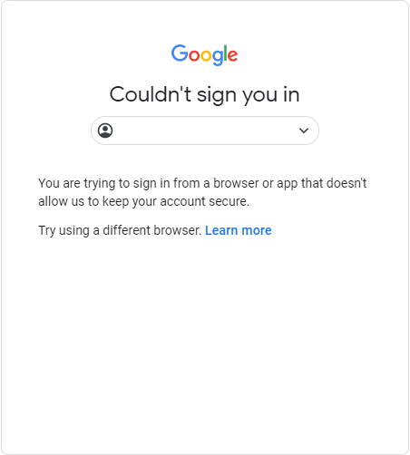
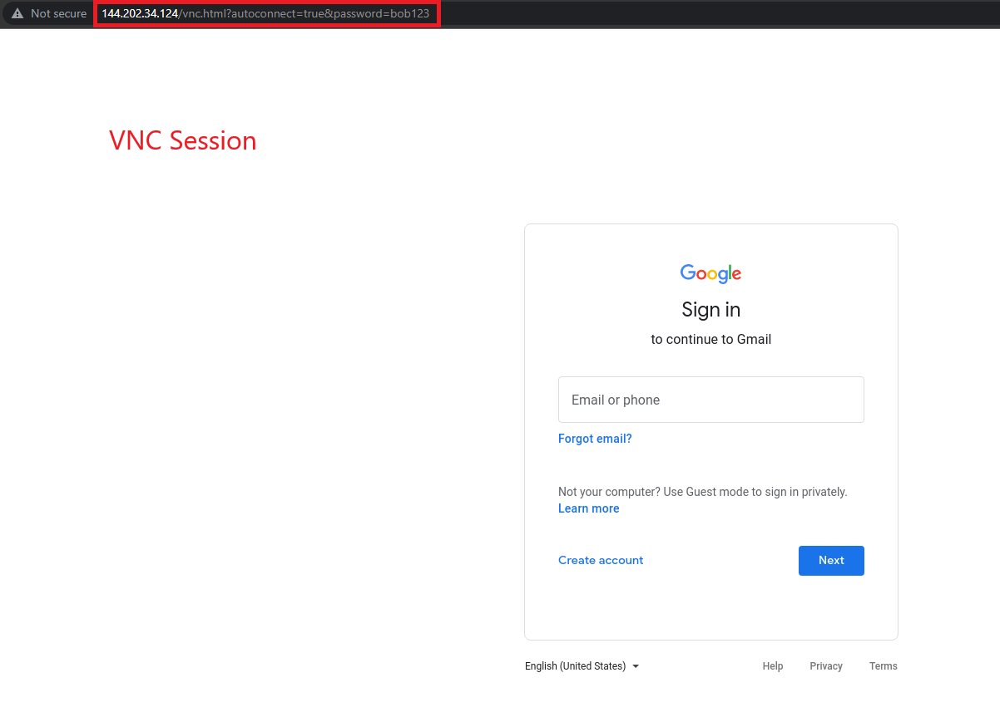
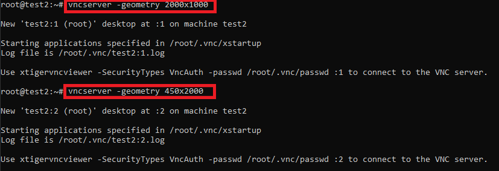
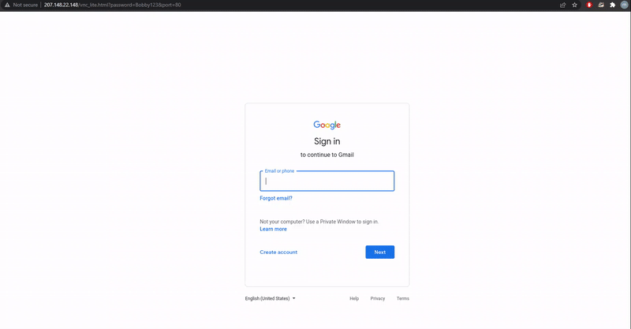

Steal credentials and bypass 2FA by giving users remote access to your server via an HTML5 VNC client that has a browser running in kiosk mode<!-- end -->.

# Introduction

Recently I was on an engagement where all the users had 2FA enabled on their email. I quickly setup the great <a href="https://github.com/kgretzky/evilginx2" target="_blank">Evilginx2</a> as I usually would. I couldn't help but look at some of the outstanding issues on the Github project and realizing that some websites were implementing methods to prevent Evilginx2 and other MITM phishing tools from working. For example, if you tried using a Gmail phishlet, you probably ran into an error similar to the one shown below.

And so I made it my mission to find a new way of bypassing 2FA which eventually lead to an interesting & unorthodox technique.

# Introducing noVNC

<a href="https://novnc.com/info.html" target="_blank">noVNC</a> is both a VNC client JavaScript library as well as an application built on top of that library. noVNC runs well in any modern browser including mobile browsers (iOS and Android). Essentially, noVNC allows the web browser to act as a VNC client to remotely access a machine.

So how do we use noVNC to steal credentials & bypass 2FA? Setup a server with noVNC, run Firefox (or any other browser) in kiosk mode and head to the website you'd like the user to authenticate to (e.g. accounts.google.com). Send the link to the target user and when the user clicks the URL they'll be accessing the VNC session without realizing. And because you've already setup Firefox in kiosk mode all the user will see is a web page, as expected.

The ways that this can be abused are endless:

* Have JS injected into the browser
* Have a HTTP proxy connected to the browser that's logging everything
* Close the VNC session when the user authenticates
* Grab the session token from the browser (Right Click > Inspect > Application > Cookies) after the user disconnects
* Have a keylogger running in the background
* Or be creative and come up with another way (remember it's your server).

# noVNC Setup & Demo

## Step 1 - Deploy an Ubuntu Instance

Use any cloud service provider to deploy a Linux machine. I'll be using Ubuntu for this demo but of course it can be any other Linux flavour you're comfortable with.

## Step 2 - Install TigerVNC

First we need to install a VNC software. I tested two VNC software: TightVNC & TigerVNC. After various tests I've opted to use TigerVNC and you should too as it'll save you a headache later on. I used <a href="https://www.cyberciti.biz/faq/install-and-configure-tigervnc-server-on-ubuntu-18-04/" target="_blank">this guide</a> to setup TigerVNC. But if you're too lazy to read it here's a TLDR of the commands you need to run:

    sudo apt update
    sudo apt install tigervnc-standalone-server tigervnc-xorg-extension tigervnc-viewer
    sudo apt install ubuntu-gnome-desktop
    sudo systemctl enable gdm
    sudo systemctl start gdm

Setup a VNC password.

    vncpasswd

You need to create the file below.

    nano ~/.vnc/xstartup

And paste:

    #!/bin/sh
    # Start Gnome 3 Desktop 
    [ -x /etc/vnc/xstartup ] && exec /etc/vnc/xstartup
    [ -r $HOME/.Xresources ] && xrdb $HOME/.Xresources
    vncconfig -iconic &
    dbus-launch --exit-with-session gnome-session &

Add execute permissions.

    chmod +x ~/.vnc/xstartup

And finally, restart the VNC server. Note that the VNC session will use a fixed screen resolution of 2000x1000. Don't worry too much about this, noVNC auto scaling will be demonstrated later on in the article.

    vncserver -depth 32 -geometry 2000x1000

## Step 3 - Download & Run noVNC

You can grab noVNC from the Github repo below.

    git clone https://github.com/novnc/noVNC.git

Running noVNC is even easier. There are two options: either run it locally (for testing purposes) or publicly. Both ways are demonstrated below.

    # Running it locally
    # Assumes VNC is running on port 5901
    # Check port by running vncserver -list
    ./noVNC/utils/novnc_proxy --vnc localhost:5901

    # To access it locally use a SSH tunnel:
    ssh -L 6080:127.0.0.1:6080 root@server

    # Running it publicly on port 80
    ufw allow http
    ./noVNC/utils/novnc_proxy --vnc 0.0.0.0:5901 --port 80

## Step 4 - Run The Browser in Kiosk Mode

This command will need to be run from within the VNC session or else you'll get an error stating that the DISPLAY environment variable is not set.

    firefox --app=https://gmail.com --kiosk

## Step 5 - Access The Page

The `password=VNCPASSWORD` will make the user auto authenticate. noVNC is very flexible. If you'd like to rename the query parameter it's possible by modifying the `vnc_lite.html` file.

    http://127.0.0.1:6080/vnc_lite.html?password=VNCPASSWORD

## Step 6 - Removing The Top Bar

noVNC displays a bar at the top saying 'Connected to XXXXX'. It can be easily removed by modifying the `vnc_lite.html` file. Search for `#top_bar` and set it to `display:none`.

# Running Multiple VNC Sessions

So far what I've shown you will get you a single phishing page running which is good enough if you're planning on spear phishing. But what if you'd like to run a large phishing campaign and require several VNC instances? Remember, you cannot send the same link to different users since they'd be sharing the same VNC session. The solution is quite simple and can be easily automated.

First, launch X number of instances of tigerVNC. I'll be keeping it simple and launching 2 instances.

Use `vncserver -list` to check which ports each session is using.

The first tigerVNC session (port 5901) will be publicly accessible on port 80. The second tigerVNC session (port 5902) will be publicly accessible on port 81.

Now you can easily access the different sessions by appending the query parameter `&port=80` or `&port=81`. A demo is shown below where port 80 has the Gmail login page and port 81 has the Facebook login page.

# noVNC Auto Scaling

To use noVNC's auto scale feature simply tag on another query parameter `&scale=true`. The auto scaling functionality is not always great at making maximizing the screen so I recommend you run some tests before using it.

# Ubuntu - Disable Auto Screen Lock

Don't forget to disable auto screen lock otherwise a user will click your phishing link and hit a locked screen.

    gsettings set org.gnome.desktop.lockdown disable-lock-screen 'true'
    gsettings set org.gnome.desktop.screensaver lock-enabled false

# Passively Spying on Users 

It's possible to open the same link as the one sent to the target user and passively watch what they are doing. Be cautious as any interaction you do would appear to the user as well.

# Alternative Software

This technique is not limited to using noVNC as many other solutions offer remote access via the browser such as:

* <a href="https://guacamole.apache.org/" target="_blank">Apache Guacamole</a>
* <a href="https://www.teamviewer.com/en-us/company/press/teamviewer-enables-web-based-remote-access/" target="_blank">TeamViewer</a>
* <a href="https://remotedesktop.google.com/access/" target="_blank">Chrome Remote Desktop</a>

# Limitations & Things to Consider

* **You are giving remote access to your machine!** It should not have anything of value stored on it. Any logged data should proably be sent to a remote machine.
* **Don't use the root account**. You should setup a restricted user account that uses the VNC service.
* You should also setup kiosk mode in a more restricted manner.
* I couldn't manage to make noVNC work properly with phones.

# Conclusion

Browsers are more powerful than ever and the usage of browsers as clients for remote access provides new ways for attackers to steal credentials, bypass 2FA and more. I strongly believe that what I've demonstrated in this article is only a small portion of what this technique can be used for. As usual, feel free to build off this technique or provide comments and feedback on Twitter.