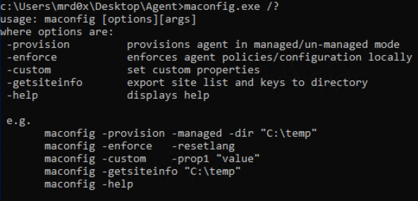
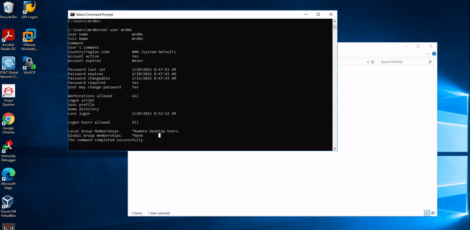
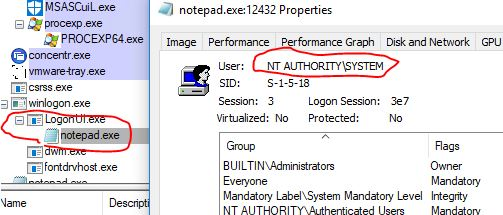

Discovery and exploitation of two Zero-Day vulnerabilities affecting Mcafee Agent < 5.7.3 and McAfee Drive Encryption < 7.2.9.5<!-- end --> 

# Introduction

At the beginning of 2021 I had some free time so I tried to find vulnerabilities in McAfee products. After a week of testing various techniques **I managed to discover two Zero-Day vulnerabilities**. Below I explain how I discovered and exploited them.

# Dumping SiteList.xml With User Privileges (CVE-2021-31838)

This vulnerability affects **McAfee Agent < 5.7.3** and requires normal user privileges.

Sitelist.xml is an important target when attacking machines with McAfee products. It contains UNC paths, usernames, server names, and encrypted passwords (which can be decrypted). In my <a href="https://blog.thecybersecuritytutor.com/abusing-mcafee-vulnerabilities-misconfigurations/">previous article</a>, I listed a few ways to find sitelist.xml. This vulnerability creates another way to get ahold of sitelist.xml.

## Discovering The Vulnerability

While looking around the McAfee Agent folder I found an interesting executable that comes with the agent. Maconfig.exe is a tool that can be used to dump sitelist.xml, the only problem is it requires administrator privileges.

If you try to run it from an account with low privileges you'll get 'Access is Denied'.

Fortunately, I noticed a problem with the permissions set on the parent folder which contains the executable maconfig.exe. A user with low privileges can copy and paste the parent folder to a different location and with that in mind, I copied the parent folder to my desktop and tried executing maconfig.exe and it ran!

## Exploitation

Exploiting the vulnerability is extremely easy:

1. Copy the folder "C:\Program Files\McAfee\Agent" to a location you have write access to (e.g. Desktop)
2. Run the following command: **maconfig.exe -getsiteinfo \[destination\]**
3. Use <a href="https://github.com/funoverip/mcafee-sitelist-pwd-decryption">this tool</a> to decrypt the passwords in sitelist.xml

## Demo

# DLL Hijacking For Privilege Escalation & Persistence

This vulnerability affects **McAfee Drive Encryption < 7.2.9.5** and requires local administrator privileges as a prerequisite.

I was able to execute any DLL upon the screen locking or unlocking. I was surprised at first because most (if not all) security vendors prevent any external DLLs from being injected into their processes. After a few hours of testing and analysis I eventually understood why this works.

## Discovery

Finding this vulnerability required some digging in the registry. Most McAfee registry keys cannot be edited due to tamper prevention/HIPS. Fortuantely, some keys are not protected by tamper prevention/HIPS and can be modified. Some of the unprotected registry keys contain paths to a McAfee DLL. Upon changing the path to a custom DLL, nothing happens, because McAfee prevents external DLLs from being injected... that is except for one key.

    Computer\HKEY_LOCAL_MACHINE\SOFTWARE\McAfee EndPoint Encryption\AppExtensions\MfeCryptoAdapter

This registry key contains 'DllPath' and the value can be modified by anyone with local administrator privileges. Upon setting this to a custom DLL, it will run everytime the screen is locked or unlocked.

It turns out the reason this works is because the DLL isn't injected into a McAfee process, rather it's injected into the Logon User Interface (LogonUI.exe). And since LogonUI.exe runs with NT AUTHORITY/SYSTEM privileges, our DLL inherits those permissions.

## Exploitation

To exploit this vulnerability follow the steps below:

1. Create your malicious dll (let's call it evil.dll)
2. Run the following command to modify the registry: **reg add "HKLM\SOFTWARE\McAfee EndPoint Encryption\AppExtensions\  MfeCryptoAdapter" /t reg_sz /v dllpath /d C:\path\to\malicious\dll\evil.dll**

## Demo

I created a simple DLL that launches Notepad.exe and modified the registry key to point to my DLL. You can lock the screen with cmd prompt using **rundll32.exe user32.dll,LockWorkStation**.

We see below that notepad is launched with SYSTEM privileges.

## No CVE issued

Unfortunately after reporting this vulnerability to McAfee they replied with the following:

*We are not planning to put another CVE for the DLL Hijacking issue as fixing the registry keys will automatically get this resolved.*