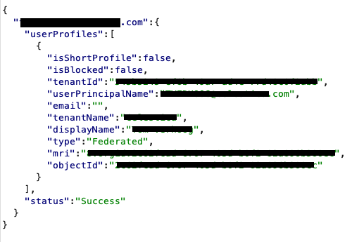
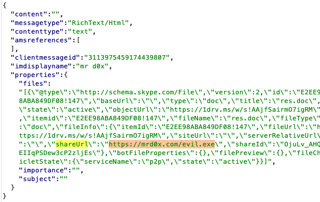
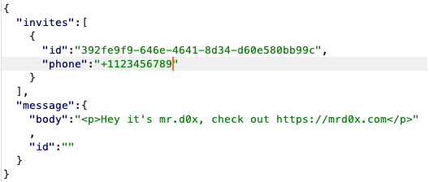

UPDATED: With the announcment that Microsoft allows users outside of an organization to message users, I revisited Teams and added new techniques<!-- end -->.

# Gathering Information From An Email Or Number

Use the search bar at the top to search for an email address (or number). Look at Burp for the following request:

`POST /api/mt/beta/users/searchUsers`

If the email entered uses Microsoft Teams, then you'll get information back as shown below.

# Message Request Approval Bypass

Message request approval is a safety feature that's implemented to prevent messages from strangers. This safety feature requires explicit approval by the user before messages can be seen.

This can be a hurdle when wanting to phish users with our upcoming spoofing techniques but luckily there's a simple way to bypass this. Create a new conversation and add the target along with one other account. This creates a group chat which does not require approval.

# Tampering With File Attachments

If you've seen the spoofing horrors in my <a href="https://mrd0x.com/spoofing-and-attacking-with-skype/">Skype article</a> then it'll be of no surprise that Microsoft Teams can be spoofed too in a very similar manner.

## #1 - Spoofing File Extension

Upload your malicious file (e.g. .exe, .hta) and intercept the request, modify the extension to an innocent one like .docx. 

When the user clicks on it, they'll download the file using the original file extension.

## #2 - Spoofing An Attachment's Link

An even better technique is to modify the link of the attachment rather than the extension. Upload a harmless file such as a .docx, then intercept the request and modify the `shareUrl` value to your malicious website hosting a file. When the user clicks on the file for download, they will download file or be redirected to the site if the file doesn't exist.

Since evil.exe doesn't exist on my website, when the file attachment is clicked it redirects the user to the site.

# Spoofing Website Previews

If you send a link such as https://microsoft.com, Teams will automatically show a preview of the link.

You can spoof this link by intercepting the request and modifying microsoft.com to your malicious domain. Microsoft's preview will appear for your malicious domain.

# Abusing The SMS Feature

You can use the Team's platform to send SMS messages to users. Using the search bar search for a number, type a message in the chat and send it.

The victim user will see something like this:

Teams may limit how many SMS messages you can send to bypass it simply modify the `id` value in the previously shown request by one character and resend the request.
