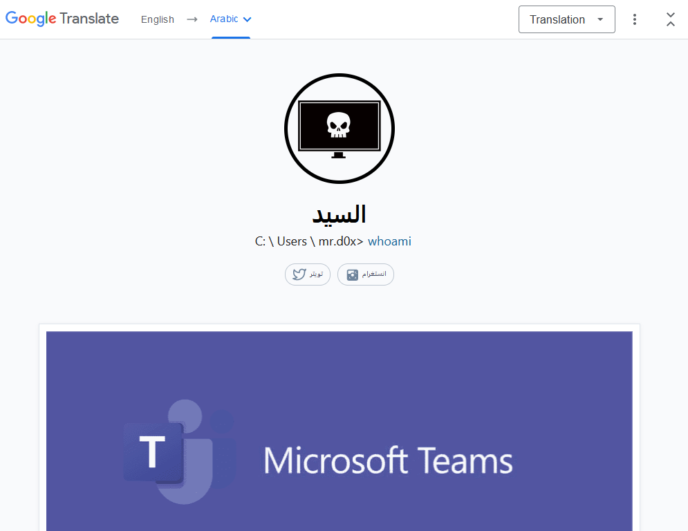
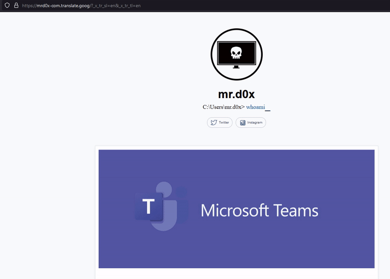

A quick and easy way to get your domain past any email spam filter by hiding behind Google's domain.<!-- end --> 

# Introduction

The way I ran into this bug (or feature, you can decide for yourself) was completely by accident. I wasn't hunting for bugs on Google this time, I actually needed to use the <a href="https://translate.google.com">Google Translate</a> service. I knew there was a way to translate domains I just couldn't remember how. After a quick search it turns out all you have to do is type in the domain name and you get a link to the translated domain as shown below.

# Masquerading Google's Domain

Clicking on the link shown in the previous image will take you to the translated domain with an interesting domain name.

`https://mrd0x-com.translate.goog/?_x_tr_sl=en&_x_tr_tl=ar&_x_tr_hl=en-GB&_x_tr_pto=nui`

## Domain Name Format

The translated domain is showing under `*.translate.goog` and so the format looks something like this:

`https://subdomain-domain-tld.translate.goog/?_x_tr_sl=en&_x_tr_tl=ar&_x_tr_hl=en-GB&_x_tr_pto=nui`

## Removing The Google Translate Bar

The only issue we have left is that annoying menu bar at the top of the screen. I played around with the URL was able to remove the menu bar.

`https://mrd0x-com.translate.goog/?_x_tr_sl=en&_x_tr_tl=en`

## Reverting Back To The Original Domain Name

One last thing to point out is that when a user clicks on another link within the domain, the URL will revert back to the real domain name.

# Conclusion

This was a quick and easy way to hide your domain behind Google's domain to bypass domain filtering, reputation checks, spam filters etc.

If you've been keeping up with my posts you know I generally don't report phishing-related bugs (or features) to companies as they almost never pay out for it.
