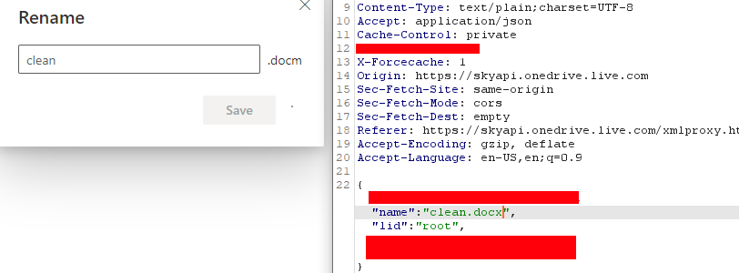
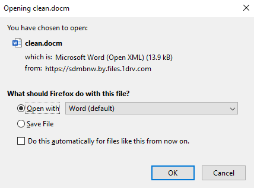
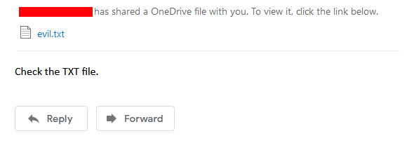
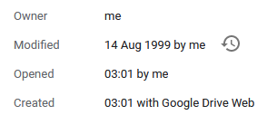

Google Drive and OneDrive contain spoofing vulnerabilities that can aid attackers with phishing<!-- end -->.

# Introduction

Google Drive and OneDrive are heavily integrated with their respective email service (Google Workspace & O365) and therefore they become a prime target for attackers wishing to phish users. During my testing I've come to find out that there are ways to spoof almost everything about a file when uploaded to the cloud such as the file name, file type, file icon and more. This article will show how to take advantage of this by emailing cloud attachments.

# Google Drive - Masquerading File Extension

In the following example I'll demonstrate how to spoof the file extension of a file on GDrive. In my case I have a .doc file that I'd like to make the user think it's a .docx.

Right click the file, click on rename and modify the file extension to .docx.

Compose an email to the target and attach the file via Google Drive attachments. When the user opens up the email they see the following:

But when they attempt to download the file, it'll be saved as the original extension (in this case .doc).

Of course, this can be done to any file extension. In the image below my .exe file looks like a .txt.

# OneDrive - Masquerading File Extension

Again, this isn't purely a Google problem as I realized OneDrive faces the same issue. Below I demonstrate how to spoof file extensions on OneDrive. First upload your malicious .docm file to OneDrive (Avoid using .doc as I noticed OneDrive will automatically change it to .docx).

Next, you'll want to rename the file extension to docx. This requires a HTTP proxy as OneDrive won't allow you to change the extension via UI.

Afterwards compose an email to the target and attach the .docx file. After sending the email, revert the file to its original extension.

The user sees file.docx but when they try to download it, it'll be file.docm.

And again to show you another example I use the same technique to hide my an executable as a .txt. And when the user tries to download the file they'll get a surprise.

# Google Drive - Masquerade File Icon

Something really great Google and Microsoft do is give us an icon based off the file type. For example, if the file is a Word document Google will place that nice innocent looking 'blue W' beside the file. It helps you distinguish between a Word document and an executable. Wouldn't it be great if we can place that icon on our executable file to entice the user to click on it? Well luckily for us we can and it's **really simple**.

Modify your .exe file to .doc locally on your machine. After you upload it to Google Drive simply rename it to .exe. DONE!

And when you email it this is what recipients see in Gmail and Outlook respectively.

## Additional MIME Types

Check out this list of <a href="https://developer.mozilla.org/en-US/docs/Web/HTTP/Basics_of_HTTP/MIME_types/Common_types" target="_blank">MIME types</a> by file extension and get creative.

# Google Drive - Modify File's Timestamp

I'm not going through this one in detail but I was also able to play around with the modified timestamp.

# Conclusion

As I presented, there's tons of spoofing opportunities for attackers to take advantage of. Feel free to reach out to me and let me know what you think of these techniques. I'm always open to feedback or even experiences if you end up using this technique.

